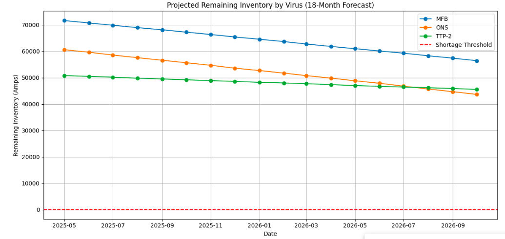
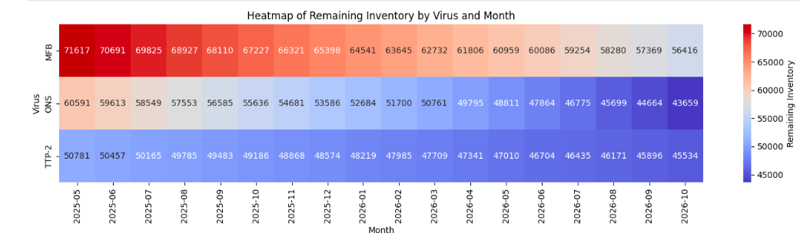

# Seed Inventory Risk Forecast – Business Intelligence Project

This project forecasts virus seed inventory usage across an 18-month period using real inventory data and simulated demand. The goal is to identify projected inventory shortages, support proactive planning, and communicate risk clearly through interactive visualizations.

---

## 📊 Project Objectives

- Simulate future demand for virus seed lots over 18 months
- Forecast remaining inventory based on cumulative usage
- Identify shortage risks by virus strain and month
- Visualize trends to drive strategic planning decisions

---

## 📁 Project Structure

```text
seed-forecast-bi-project/
├── data/
│   ├── seed_inv24apr.xlsx                          # Source inventory data
│   └── seed_demand_inventory_consolidated_18mo.csv # Simulated demand + forecasted risk
├── notebooks/
│   └── seed_inventory_18mo_risk_forecast.ipynb     # Final Jupyter Notebook with insights
├── requirements.txt                                # Python dependencies
├── .gitignore                                      # Git exclusions
└── README.md
```

---

## 💻 How to Run the Project

1. Clone this repository:
   ```bash
   git clone https://github.com/asbestositgets/seed-forecast-bi-project.git
   cd seed-forecast-bi-project
   ```

2. Create and activate a virtual environment:
   ```bash
   python -m venv venv
   source venv/bin/activate     
   ```

3. Install dependencies:
   ```bash
   pip install -r requirements.txt
   ```

4. Launch Jupyter and open the notebook:
   ```bash
   jupyter lab
   ```
   Open `notebooks/seed_inventory_18mo_risk_forecast.ipynb`

---

## 📈 Visualizations

### 📉 Remaining Inventory Over Time


### 🚨 First Forecasted Shortage Date


### 🔥 Monthly Inventory Heatmap


---

## 🛠 Tools Used

| Tool               | Purpose                                         |
|--------------------|-------------------------------------------------|
| **Python**         | Core language for data processing and analysis |
| **Pandas**         | Data manipulation and aggregation              |
| **Matplotlib**     | Line plots and visualizations                  |
| **Seaborn**        | Enhanced plotting, heatmaps, and styling       |
| **Jupyter Notebook** | Interactive analysis and storytelling        |
| **VS Code**        | Coding, version control, and project management |
| **Git + GitHub**   | Version control and collaboration              |
| **Excel**          | Initial inventory data formatting and cleanup  |

---


## ✅ Key Findings

- All three virus strains (MFB, ONS, and TTP-2) are projected to maintain sufficient inventory over the full 18-month period. It is recommended to monitor inventory expiration closely and schedule potency re-tests as lots are scheduled for use in production. 
- Despite high and fluctuating simulated demand, no shortages are forecasted during the planning horizon.
- Inventory levels remain positive across all months, indicating current stock levels are well aligned with anticipated needs.
- Visual tools like line charts and heatmaps helped confirm inventory coverage and highlight which strains are most utilized.


---

## 👤 Author

**Alijah Roedel**  
MBA Student – Business Analytics  
GitHub: [asbestositgets](https://github.com/asbestositgets)
